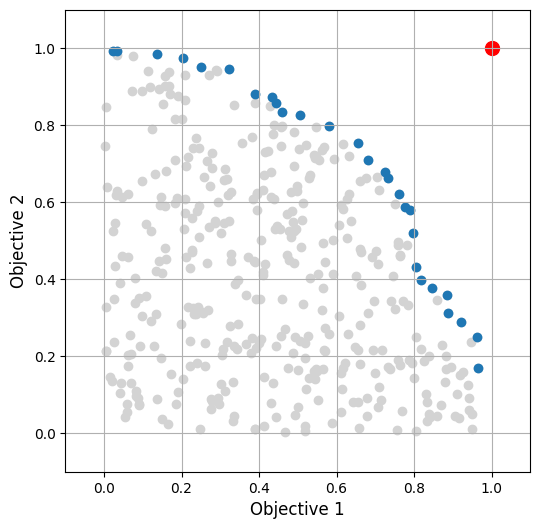
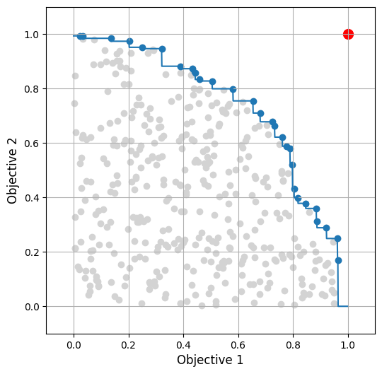
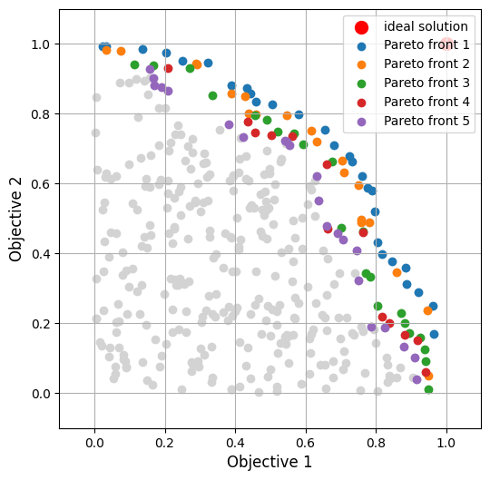

# pareto2d


`pareto2d` is a mini library for processing Pareto fronts.

It supports:

- finding Pareto fronts
- interpolating Pareto fronts
- flexible configuration related to which objective is maximized and
  which is minimized

## Examples intro - imports and data preparation

``` python
import numpy as np
import matplotlib.pyplot as plt
import pareto2d

# Important - set mode! -> which target is to be minimized and which maximized

mode = pareto2d.Mode.O1_MAX_O2_MAX
# mode = pareto2d.Mode.O1_MAX_O2_MIN
# mode = pareto2d.Mode.O1_MIN_O2_MAX
# mode = pareto2d.Mode.O1_MIN_O2_MIN

# Generate data <- REPLACE THIS SECTION WITH YOUR DATA GENERATION CODE

N = 500
o1, o2 = get_pareto2d_dataset(mode, N)
o1i, o2i = get_pareto2d_ideal_solution(mode)
```

## Example 1 - find Pareto front

``` python
# Find Pareto front
pf_mask = pareto2d.get_pf_mask(o1, o2, mode)
o1pf, o2pf = o1[pf_mask], o2[pf_mask]

# Make plot

fig, ax = plt.subplots(figsize=(6, 6))
cm = plt.get_cmap("tab10")

ax.scatter(x=o1, y=o2, color="lightgray")
ax.scatter(x=o1i, y=o2i, color="red", s=100, label="ideal solution")
ax.scatter(x=o1pf, y=o2pf, color=cm(0), label="Pareto front")

ax.set_xlabel("Objective 1", fontsize=12)
ax.set_ylabel("Objective 2", fontsize=12)
ax.grid()
ax.set_xlim([-0.1, 1.1])
ax.set_ylim([-0.1, 1.1])
```



## Example 2 - interpolate Pareto front

``` python
# Find Pareto front
o1pf, o2pf = pareto2d.get_sorted_pf(o1, o2, mode)

# Interpolate second objective from pf on the basis of first objective grid `o1dense`
o1dense = np.arange(0.0, 1.0, 0.001)
o2dense = pareto2d.interpolate_pf_o2(o1dense, o1pf, o2pf, mode)


fig, ax = plt.subplots(figsize=(6, 6))
cm = plt.get_cmap("tab10")

ax.scatter(x=o1, y=o2, color="lightgray")
ax.scatter(x=o1i, y=o2i, color="red", s=100, label="ideal solution")
ax.scatter(x=o1pf, y=o2pf, color=cm(0), label="Pareto front")
ax.plot(o1dense, o2dense, color=cm(0))

ax.set_xlabel("Objective 1", fontsize=12)
ax.set_ylabel("Objective 2", fontsize=12)
ax.grid()
ax.set_xlim([-0.1, 1.1])
ax.set_ylim([-0.1, 1.1])
```



``` python
# Interpolate first objective from Pareto front on the basis of second objective grid `o2dense`
o2dense = np.arange(0.0, 1.0, 0.001)
o1dense = pareto2d.interpolate_pf_o1(o2dense, o1pf, o2pf, mode)

fig, ax = plt.subplots(figsize=(6, 6))
cm = plt.get_cmap("tab10")

ax.scatter(x=o1, y=o2, color="lightgray")
ax.scatter(x=o1i, y=o2i, color="red", s=100, label="ideal solution")
ax.scatter(x=o1pf, y=o2pf, color=cm(0), label="Pareto front")
ax.plot(o1dense, o2dense, color=cm(0))

ax.set_xlabel("Objective 1", fontsize=12)
ax.set_ylabel("Objective 2", fontsize=12)
ax.grid()
ax.set_xlim([-0.1, 1.1])
ax.set_ylim([-0.1, 1.1])
```


## Example 3 - find successive Pareto fronts

``` python
# Prepare figure

fig, ax = plt.subplots(figsize=(6, 6))
cm = plt.get_cmap("tab10")

ax.scatter(x=o1, y=o2, color="lightgray")
ax.scatter(x=o1i, y=o2i, color="red", s=100, label="ideal solution")
ax.set_xlabel("Objective 1", fontsize=12)
ax.set_ylabel("Objective 2", fontsize=12)
ax.grid()
ax.set_xlim([-0.1, 1.1])
ax.set_ylim([-0.1, 1.1])

# Find points belonging to successive Pareto front

o1_cur = o1
o2_cur = o2

for i in range(0, 5):
    pf_mask = pareto2d.get_pf_mask(o1_cur, o2_cur, mode)
    o1pf_cur, o2pf_cur = o1_cur[pf_mask], o2_cur[pf_mask]
    o1_cur, o2_cur = o1_cur[~pf_mask], o2_cur[~pf_mask]
    ax.scatter(x=o1pf_cur, y=o2pf_cur, color=cm(i), label=f"Pareto front {i+1}")

ax.legend()
```


